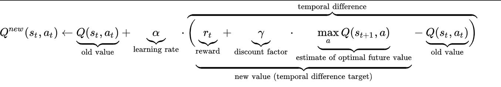

# Flappy Bird + Q-Learning agent
Projekt w ramach laboratorium Podstaw Sztucznej Inteligencji na AGH.

 

## Zagadnienie i cel
Stworzenie agenta sztucznej inteligencji zdolnego nauczyć się osiągać jak najlepsze wyniki w stworzonej kopii gry Flappy Bird.

## Gra
Stworzona w języku Python z wykorzystaniem biblioteki pygame, jest bardzo prymitywnym pod względem graficznym klonem popularnej swego czasu gry Flappy Bird.  
Gracz kontroluje skokiem tytułowego ptaszka poruszającego się w poziomie ze stałą prędkością. Jego zadaniem jest przeskoczenie przez jak największą ilość przerw w pionowych ścianach (rurach). Za ominięcie przeszkody dostaje 1 punkt.  
Gra kończy się gdy gracz uderzy przeszkodę, wpadnie w górną krawędź okna lub uderzy o ziemię. 

# Reinforcement Learning

## Q-Learning
Algorytm ze spektrum uczenia przez wmocnienie (RL).  
Zakłada obecność środowiska, inteligentego agenta, zbioru możliwych stanów środowiska $'S'$ oraz zbioru dostępnych akcji $'A'$ w każdym z tych stanów (często taki sam dla wszystkich stanów).  
Wykonując akcję agent wpływa na środowisko i zmienia jego stan. Jednocześnie dostaję nagrodę (wartość rzeczywista), której zmaksymalizowanie jest jego celem.  

Osiąga to poprzez aktualizowanie funkcji $'Q:S \times A\rightarrow \R'$, która dla każdego stanu i akcji określa przewidywaną skumulowaną nagrodę. Przed rozpoczęciem uczenia jest arbitralnie ustawiona przez twórcę w spójności ze środowiskiem.

W każdym kroku symulacji agent przeprowadza interakcję ze środowiskiem:
1. Pobiera aktualny stan środowiska $'s_t'$ (zbiór danych jednoznacznie go definiujących)
2. Na podstawie swojej funkji $'Q'$ wybiera taką akcję $'\in A'$, która zwraca najwyższą przewidywaną nagrodę w stanie $'s_t'$
3. Otrzymuje nagrodę $'r'$
4. Pobiera nowy stan środowiska $'s_{t+1}'$
5. Aktualizuje wartość $'Q(s_t,a)'$ zgodnie z równaniem Bellmana:

Agent prowadzi wykonując wiele interakcji z środowiskiem przybliża się do odnalezienia optymalnej strategii wyrażonej funkcją $'Q'$.

## Impementacja Q-Learning w projekcie
**Środowiskiem** jest gra Flappy Bird.  
**Agent** kieruje tytułowym ptaszkiem tak by jak najdłużej pozostać w grze.  

**Stan** środowiska określany jest przez trójkę $'x_0, y_0, v)'$, oznaczające odpowiednio:
- odległość agenta w osi X do lewej krawędzi najbliższej przeszkody,
- odległość agenta w osi Y od górnej krawędzi dolnej części przeszkody,
- zbinaryzowana prędkość agenta w osi pionowej (0 - gdy spada, 1 - gdy wzlatuje).  

Wartości $'x_0, y_0'$ zostały odpowiednio pogrupowane żeby wyeliminować problem zbyt gęstej przestrzeni stanów.

**Możliwe akcje** agenta:
- decyzja o skoku (akcja 1),
- lub jego braku (akcja 0).

**Nagroda** otrzymywana przez agenta w każdym kroku:
- 0 gdy nadal żyje,
- -1000 w przypadku przegranej.

Dodatkowo został wprowadzony parametr $'\epsilon'$, który określa prawdopodobieństwo wykonania przez agenta losowej akcji. Parametr ten wpływa pozytywnie na uczenie gdyż pozwala na eksplorację alternatywnych ścieżek. Jest on jednak z gry na grę wykładniczo zmniejszany, żeby ostatecznie agent wykonywał najbardziej optymalne akcje.

# Wyniki

# Podsumowanie

Projekt, patrząc na wyniki stworzonego agenta, osiągnał swój cel - agent faktycznie nauczył się grać w grę i dodatkowo robi to lepiej niż niejeden śmiałek (spokojnie wystawiłbym go do mistrzostw Flappy Birda ;)) ). Od swojej strony mogę dodać, że eksploracja algorytmu Q-Learning w takiej formie była bardzo przyjemna, nie mówiąc o dumie iście ojscowskiej jak agent zaczynał zdobywać pierwsze punkty w grze a dalej pobiajać światowe rekordy.

## Future Work
Widzę oczywiście wiele możliwości rozwinięcia projektu:
1. utrudnienie gry i dodanie większej ilości parametrów określających stan środowiska,
2. poeksperymentowanie z hyperparametrami Q-Learning: 
   1. learning rate $'\alpha'$,
   2. decay rate $'\gamma'$,
   3. inne wartości nagród,
   4. wartość $'\epsilon'$,
3. poprawienie graficznej strony gry - chociaż muszę przyznać, że podoba mi się taka minimalistyczna forma,
4. inne algorytmy uczenia przez wzmacnianie, takie jak:  Deep Q-Learning, policy network,
5. inne gry.

